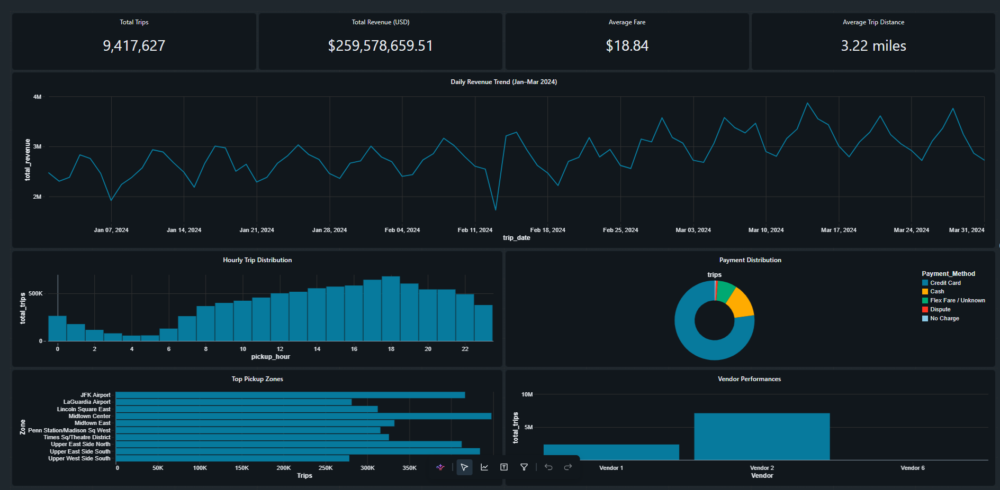
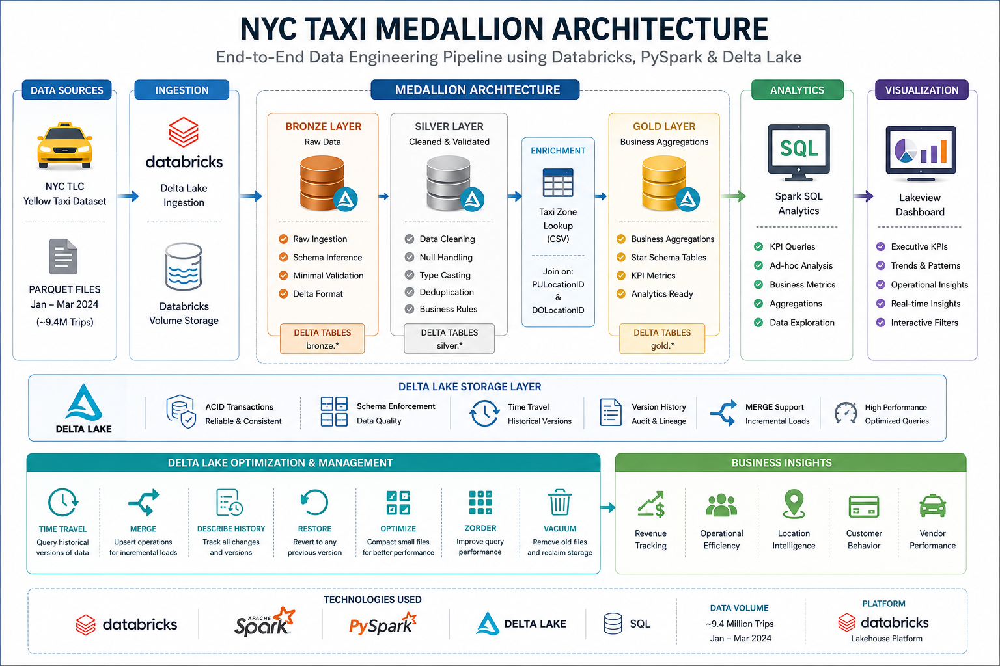

# NYC Taxi Medallion Architecture



End-to-end Databricks lakehouse project built on the NYC Taxi trip records. This repository demonstrates a production-style Medallion Architecture pipeline with Bronze, Silver, and Gold Delta tables, Delta Lake maintenance operations, SQL analytics, and an interactive dashboard for business insights.

## Project Snapshot

- **Platform:** Databricks Free Edition
- **Core stack:** PySpark, Spark SQL, Delta Lake, Databricks Lakeview Dashboards
- **Data volume:** 9.4M+ taxi trips processed across Jan–Mar 2024
- **Goal:** Turn raw NYC taxi trip records into clean, analytics-ready business tables and an executive dashboard

## Architecture



## What this project does

1. Ingests raw Parquet files into Databricks Volume storage.
2. Profiles the data to identify nulls, invalid values, and outliers.
3. Builds a **Bronze** Delta table that preserves raw records.
4. Cleans and validates data in the **Silver** layer.
5. Enriches trip data using the NYC Taxi Zone Lookup dataset.
6. Creates multiple **Gold** tables for business reporting.
7. Demonstrates Delta Lake capabilities such as **Time Travel**, **RESTORE**, **MERGE**, **OPTIMIZE**, **ZORDER**, and **VACUUM**.
8. Presents the results in an interactive dashboard.

## Medallion Architecture

### Bronze
Raw source data stored as Delta with minimal transformation so the original input remains recoverable.

### Silver
Cleaned, validated, deduplicated data with obvious anomalies removed and selected nulls handled through explicit business rules.

### Gold
Business-facing aggregates designed for reporting and dashboarding, such as revenue trends, hourly demand, payment distribution, and top pickup zones.

## Key Features

- Spark-based ingestion from Parquet files
- Data profiling and quality checks
- Bronze/Silver/Gold Delta tables
- Zone enrichment via taxi zone lookup join
- SQL analytics with aggregations and window functions
- Delta Lake time travel and version history
- `UPDATE`, `RESTORE`, `MERGE`, `OPTIMIZE`, `ZORDER`, `VACUUM`
- Business dashboard built in Databricks

## Dashboard

The dashboard highlights:

- Total trips
- Total revenue
- Average fare
- Average trip distance
- Daily revenue trend
- Hourly trip distribution
- Payment method distribution
- Top pickup zones
- Vendor performance

## Notebooks

The Databricks workspace contains the full implementation in ordered notebooks:

- `01_Data_Exploration`
- `02_Bronze_Layer`
- `03_Silver_Layer`
- `04_Gold_Layer`
- `05_Data_Enrichment`
- `06_SQL_Analytics`
- `07_Delta_Lake`
- `07B_Delta_Merge_Demo`
- `08A_Caching`
- `08B_Performance_Engineering`
- `09_Dashboard`

## Repository Structure

```text
NYC-Taxi-Medallion-Architecture/
├── README.md
├── LICENSE
├── .gitignore
├── notebooks/
├── docs/
├── images/
└── dataset_link.md
```

## Dataset

This project uses the official NYC TLC Yellow Taxi trip records and taxi zone lookup data.

- NYC TLC trip record data: https://www.nyc.gov/site/tlc/about/tlc-trip-record-data.page
- Taxi zone lookup: https://d37ci6vzurychx.cloudfront.net/misc/taxi_zone_lookup.csv

## Business Value

This pipeline helps answer questions such as:

- Which days generate the most revenue?
- When is taxi demand highest?
- Which pickup zones are busiest?
- Which payment methods are most common?
- Which vendors carry the most trips?

## Delta Lake Features Used

- ACID transactions
- Transaction log (`_delta_log`)
- Time travel
- Table version history
- `MERGE INTO`
- `RESTORE TABLE`
- `OPTIMIZE`
- `ZORDER BY`
- `VACUUM`

## Screenshots

- Dashboard overview: `images/dashboard.png`
- Revenue trend: `images/revenue_trend.png`
- Payment distribution: `images/payment_distribution.png`
- Top pickup zones: `images/top_pickup_zones.png`

## Future Improvements

- Add incremental ingestion for future monthly taxi files
- Automate pipeline refresh with Databricks Jobs
- Add more gold tables for borough-level and day-of-week analytics
- Extend the dashboard with date filters and comparison views

## Why this project matters

This project was built to mirror how real data engineering teams structure lakehouse pipelines. It is not just a notebook exercise; it shows ingestion, validation, transformation, enrichment, analytics, optimisation, and presentation in one end-to-end workflow.
