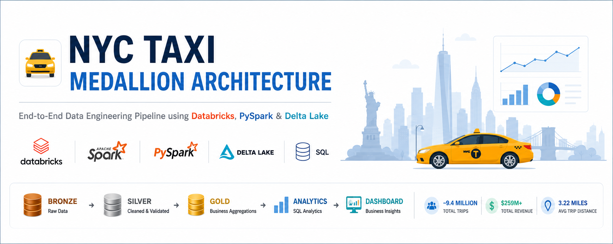

# 🚖 NYC Taxi Medallion Architecture

<p align="center">
  
</p>

<p align="center">


</p>

---

## 📖 Overview

This project implements an end-to-end **Lakehouse Data Engineering Pipeline** using the **Medallion Architecture** on **Databricks**.

Raw NYC Yellow Taxi trip records are transformed into analytics-ready datasets through **Bronze**, **Silver**, and **Gold** Delta tables before being visualised in an interactive **Lakeview Dashboard**.

The project demonstrates production-style ETL design, Delta Lake operations, Spark SQL analytics, and dashboard development on a dataset containing **9.4+ million taxi trips**.

---

# 🏗️ Architecture

<p align="center">

</p>

---

# 📊 Dashboard

<p align="center">

</p>

---

# 📈 Business Insights

The dashboard provides:

- 🚖 Total Trips
- 💰 Total Revenue
- 💳 Average Fare
- 📍 Average Trip Distance
- 📅 Daily Revenue Trend
- 🕒 Hourly Trip Distribution
- 💳 Payment Distribution
- 📍 Top Pickup Zones
- 🚖 Vendor Performance

---

# 🛠️ Tech Stack

| Category | Technology |
|-----------|------------|
| Platform | Databricks Free Edition |
| Language | Python |
| Processing | PySpark |
| Query Engine | Spark SQL |
| Storage | Delta Lake |
| Catalog | Unity Catalog |
| Dashboard | Databricks Lakeview Dashboard |

---

# 🏛️ Medallion Architecture

## 🥉 Bronze Layer

- Raw Parquet ingestion
- Original schema preserved
- Delta format
- Immutable raw storage

Notebook

```text
02_Bronze_Layer
```

---

## 🥈 Silver Layer

Data Quality Improvements

- Duplicate removal
- Null handling
- Invalid fare removal
- Invalid timestamps removed
- Distance validation

Notebook

```text
03_Silver_Layer
```

---

## 🥇 Gold Layer

Business-ready aggregates

Created tables

- gold_daily_summary
- gold_hourly_summary
- gold_payment_summary
- gold_vendor_summary
- gold_zone_summary

Notebook

```text
04_Gold_Layer
```

---

# 🔄 ETL Pipeline

```
NYC TLC Dataset

↓

Bronze

↓

Silver

↓

Zone Enrichment

↓

Gold

↓

SQL Analytics

↓

Lakeview Dashboard
```

---

# 📁 Repository Structure

```text
NYC-Taxi-Medallion-Architecture/
│
├── README.md
├── LICENSE
├── dataset_link.md
│
├── notebooks/
│
├── docs/
│
└── images/
```

---

# 📚 Project Documentation

| Document | Description |
|----------|-------------|
| Architecture.md | Overall system architecture |
| BusinessRules.md | Cleaning & validation rules |
| DataDictionary.md | Dataset & schema documentation |
| DashboardGuide.md | Dashboard explanation |
| DeltaLake.md | Delta Lake operations |
| InterviewQuestions.md | Common interview questions |

---

# ⚡ Delta Lake Features

Implemented and demonstrated:

- ✅ UPDATE
- ✅ DELETE
- ✅ MERGE
- ✅ Time Travel
- ✅ RESTORE
- ✅ DESCRIBE HISTORY
- ✅ OPTIMIZE
- ✅ ZORDER
- ✅ VACUUM

---

# 📓 Notebooks

The project is organised into sequential notebooks:

1. Data Exploration
2. Bronze Layer
3. Silver Layer
4. Gold Layer
5. Data Enrichment
6. SQL Analytics
7. Delta Lake
8. Delta MERGE Demo
9. Caching
10. Performance Engineering
11. Dashboard

---

# 🚀 Running the Project

1. Create a Databricks Free Edition workspace.
2. Download the NYC TLC Taxi dataset.
3. Upload the files to a Unity Catalog Volume.
4. Import the notebooks.
5. Execute them in numerical order.
6. Open the Lakeview Dashboard.

---

# 📂 Dataset

This project uses the official NYC TLC Yellow Taxi Trip Record dataset.

Download links are available in

```text
dataset_link.md
```

---

# 💼 Business Value

This solution demonstrates how modern Data Engineering pipelines transform raw operational data into business-ready insights.

Key outcomes include:

- Revenue analysis
- Demand forecasting support
- Zone popularity analysis
- Vendor performance comparison
- Payment behaviour analysis

---

# 🎯 Interview Highlights

This project demonstrates practical experience with:

- Medallion Architecture
- Apache Spark
- Delta Lake
- PySpark
- Spark SQL
- Data Cleaning
- ETL Pipelines
- Business Intelligence
- Dashboard Development

---

# 🔮 Future Improvements

- Incremental ingestion
- Databricks Jobs scheduling
- Streaming pipeline
- CI/CD deployment
- Automated data quality checks
- ML-based demand forecasting

---

# 👨‍💻 Author

**Jay Gautam**

- GitHub: https://github.com/Jay121305
- LinkedIn: https://www.linkedin.com/in/jay-gautam/

---

## ⭐ If you found this repository useful, consider giving it a star!
